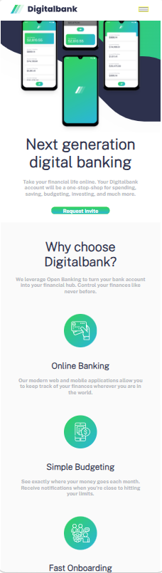
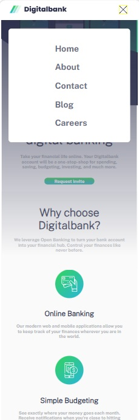
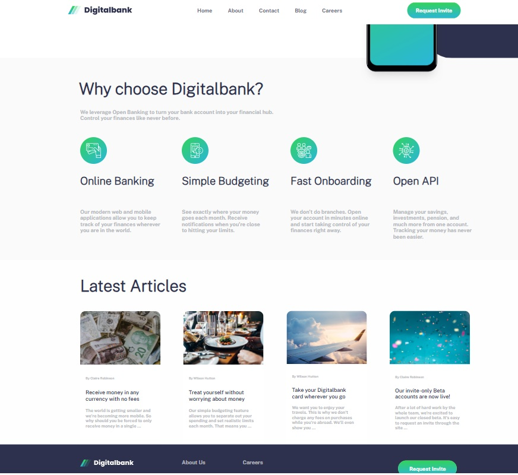

# Frontend Mentor - Digitalbank landing page solution

This is a solution to the [Digitalbank landing page challenge on Frontend Mentor](https://www.frontendmentor.io/challenges/digital-bank-landing-page-WaUhkoDN). Frontend Mentor challenges help you improve your coding skills by building realistic projects.

## Table of contents

- [Overview](#overview)
  - [The challenge](#the-challenge)
  - [Screenshot](#screenshot)
  - [Links](#links)
- [My process](#my-process)
  - [Built with](#built-with)
- [Author](#author)

## Overview

### The challenge

Users should be able to:

- View the optimal layout for the site depending on their device's screen size
- See hover states for all interactive elements on the page

### Screenshot on screen size width 375px

### Screenshot on screen size width 375px (menu clicked)

### Screenshot on screen size width 1440px

### Links

- Solution URL: [solution url for Digital bank landing page challenge](https://github.com/handipo2022/digital-bank-landing-page)
- Live Site URL: [live url Digital bank landing page](https://handipo2022.github.io/digital-bank-landing-page/)

## My process

### Built with

- Semantic HTML5 markup
- CSS custom properties
- Flexbox
- Mobile-first workflow

## Author

- Frontend Mentor - [@zhb](https://www.frontendmentor.io/profile/handipo2022)
